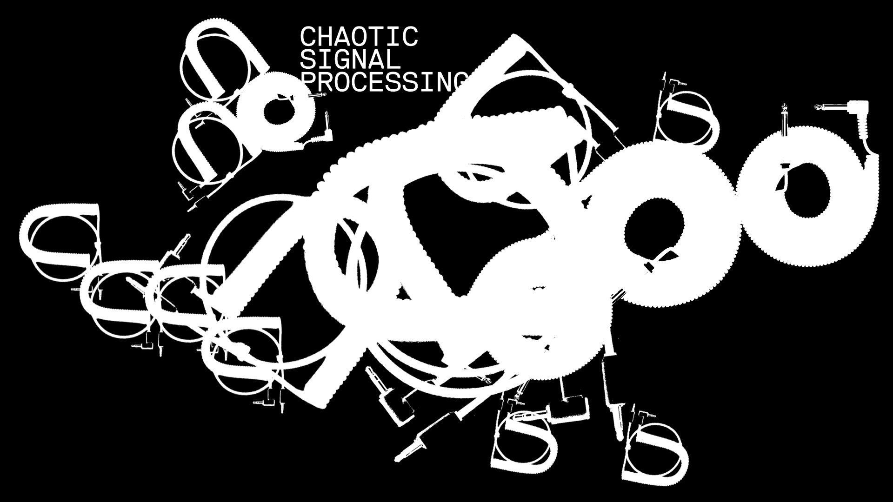

---

DSSISCLAIMAR
&nbsp;
&nbsp;
&nbsp;
&nbsp;
&nbsp;
&nbsp;
&nbsp;&nbsp;&nbsp;&nbsp;&nbsp;&nbsp;&nbsp;&nbsp;&nbsp;&nbsp;&nbsp;&nbsp;&nbsp;&nbsp;&nbsp;&nbsp;&nbsp;&nbsp;&nbsp;&nbsp;&nbsp;&nbsp;&nbsp;&nbsp;&nbsp;&nbsp;&nbsp;&nbsp;&nbsp;&nbsp;&nbsp;&nbsp;&nbsp; ‹‹‹ DPP ON DSP


---

## prerequisite

- install [Wellen](https://github.com/dennisppaul/wellen) 
- download [Audacity](https://www.audacityteam.org)

---


---

# Chaotic Signal Process  (CSP)

C = Chaotic
S = Signal 
P = Process

---

```
+------------------------------+
|                              |
| CHAPTER#01 :: INFRASTRUCTURE |
|                              |
+------------------------------+
```

---

## reason#1

learn the very basic, become literate.    
do not just consume but also produce.

---

## reason#2 

translates well into other contexts e.g MCU

---

how to learn + use DSP: mental models + paper ( + ChatGPT )

---

## what are signals?    

›rotate your head to the side‹
stream of waves

---

## the sample

- continuous to discrete
- time domain

#visualize

---

@audacity
look at recordings
generate tone

---

## Anatomy of a DSP System

```
ADC > PROCESSOR > DAC
```
Analog to Digital Converter (ADC)
Processing Unit (PROCESSOR)
Digital to Analog Converter (DAC)
#visualize

---

## conventions

- values are floats
- range from (-1.0, 1.0)
- signal are processed in audio blocks
- sampling rate is 48KHz ( bit-depth 16bit )

---

## Processor=In+Ouput-Function

- @wellen
- `float audio(float) {}` 
- magic function
- ( e.g `random` )

#hands_on

---

```
+---------------------+
|                     |
| CHAPTER#02 :: NODES |
|                     |
+---------------------+
```

---

```


+-----------+               +-----------+               +-----------+
| GENERATOR |--OUT00  IN00--| PROCESSOR |--OUT01  IN00--| CONSUMER  |
|           |--OUT01  IN01--|           |               +-----------+
+-----------+               +-----------+                    


```
3 kinds of nodes: GENERATOR, PROCESSOR, CONSUMER

---

## node categories

- oscillator
- noise
- filters
- effects ( e.g distortion )
- envelope
- instruments

#visualize

---

## reason#3

create your own nodes
#hands_on
( e.g amplifier ) #PYO

---

observe+modify
#hands_on

---

```
+---------------------------+
|                           |
| CHAPTER#03 :: COMPOSITION |
|                           |
+---------------------------+
```

---

- composing with nodes
- composing with structures

---

additive vs subtractive vs FM synthesis

---


additive synthesis
#visualize

#hands_on

---

## structures

- beat
- events/trigger ( modulo )
- patterns/arpeggio
- loops/phasing

---

```
LOOP_A: ×---×---×---×---×---×---×---×---×---×---×---
LOOP_B: ×--×--×--×--×--×--×--×--×--×--×--×--×--×--×-
LOOP_C: ×----×----×----×----×----×----×----×----×---
```

---

## reason#4

generative composition can create truely complex structures

---

## reason#5

sonification ( data + parameters + interactions )

---

## ask ChatGPT some questions:

- can you explain additive, subtractive and other forms of audio synthesis?
    - what makes a square wave a "complex" waveform?
- can you list digital audio effects?
- can you list digital audio filters?
- can you show some distortion algorithms?
- can you write an algorithm in c++ that performs an Overdrive distortion?
- can you write c++ code that emulates an analog speaker distortion?

---

## ideas for experiments

- external devices ( MIDI, guitar, multi-channel )
- playing with GUIs
- simple granualar synthesis ( many fragements of the same sample )
- the human voice ( synthesized, recorded )

#hands_on

